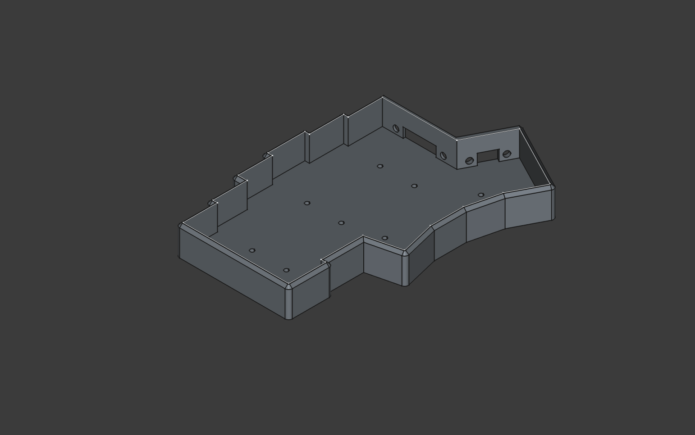
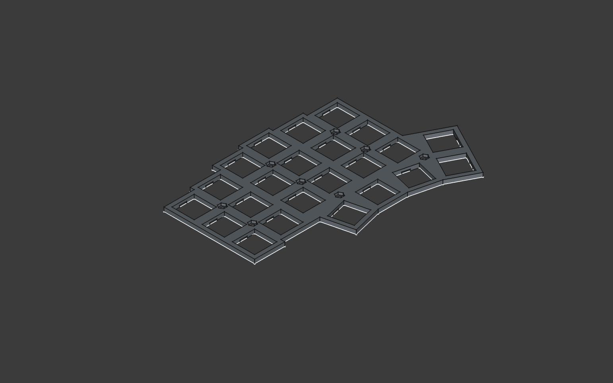
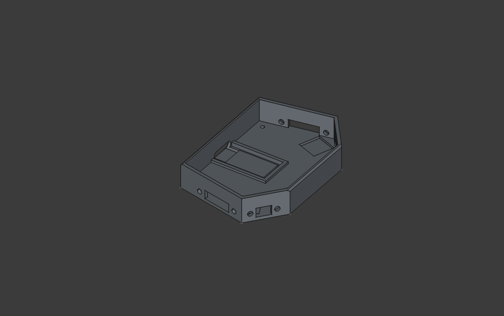
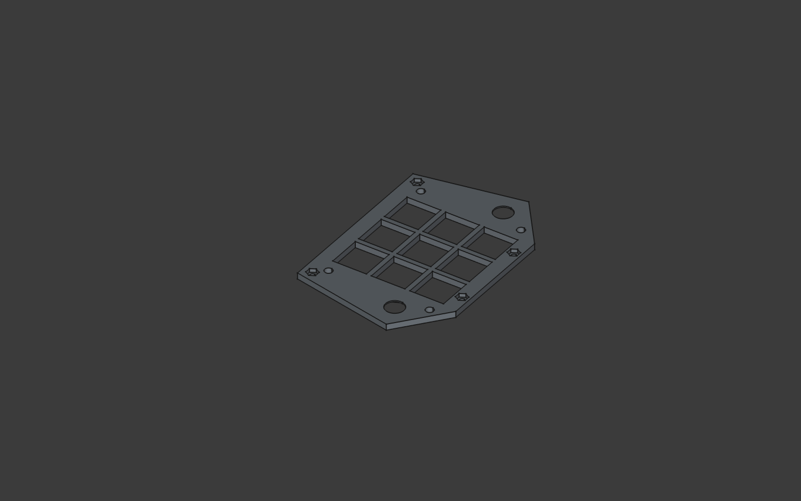
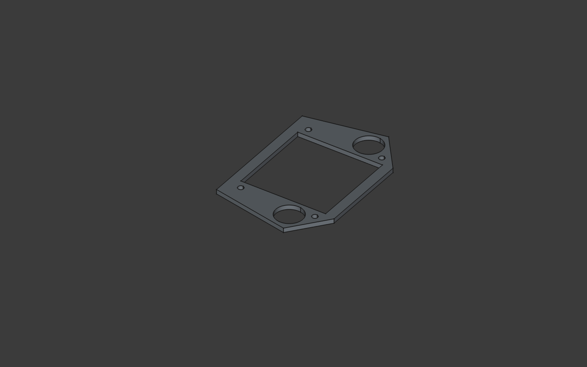
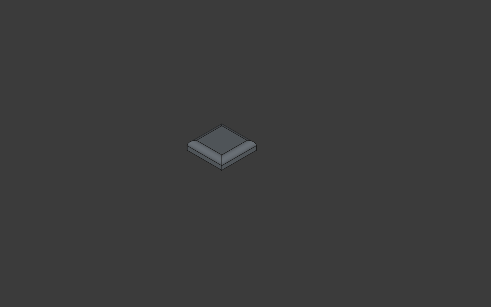
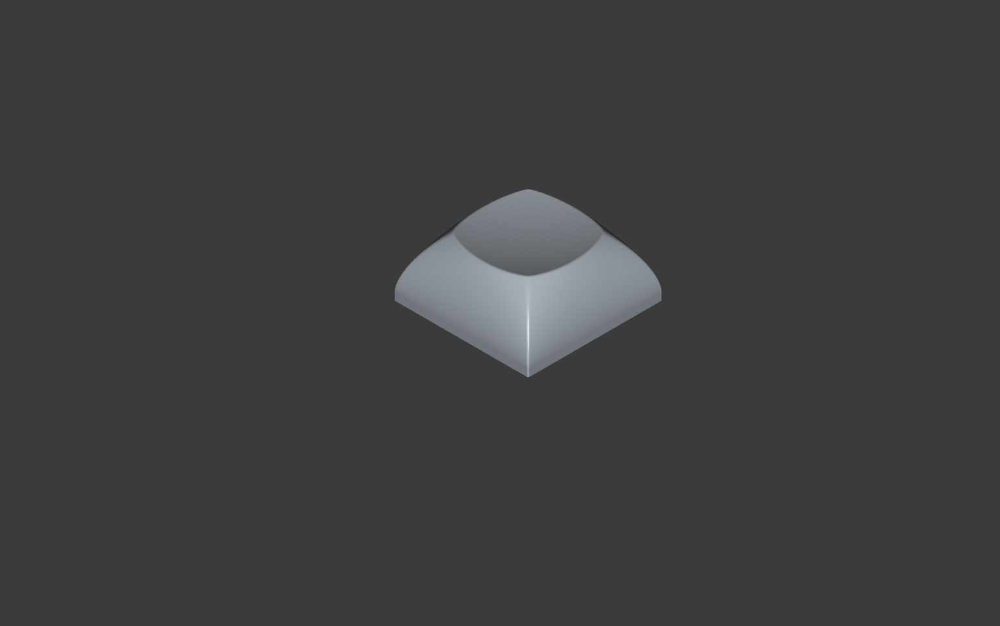

# ermbkbd - Eriks Monoblock Keyboard

ermbkbd is a qmk powered, 3D printed, handwired 46 key mx monoblock/unibody split keyboard
with a integrated 3x3 choc v2 mini macropad and dual encoders.

The project also includes a custom dsa inspired mx keycap.

It's an evolution of my first keyboard [erkbd](https://github.com/erikpeyronson/erkbd/tree/main)

The keyboard was designed using [FreeCAD](https://www.freecad.org/) and was printed
using a Creality Ender 3v3 ke 3D printer using black Creality CR PLA and white and SUNLU PLA+ filament

# Images

## Issues and things to be aware of before building

Be warned, this keyboard is a little tricky to build.

The clearance between the centerpiece and macropad plate is only 5mm and there
are a lot of wires that needs to fit together with the controller, encoders and
macropad matrix. Thin gauge stranded wires for connecting the rows and columns
of the different matrices together is reccomended

I petty much had to isolate the controller from the matrix pins with a sheet of
folded electrical tape and force it together. Someone more experienced could
probably do it better but i do not recommend this for a beginner. Build at your
own risk.

The keycaps didnt turn out great but other than that i am pretty happy with the
end result

## BOM

- 46 pcs mx compatible switches
- 9 pcs choc v2 switches
- 1 pcs pro micro footprint rp2040 controller [link](https://www.aliexpress.com/item/1005005881019149.html).
- 55 pcs 1N4148 diodes (or similar) [link](https://www.amazon.com/BOJACK-Switching-IN4148-Electronic-Silicon/dp/B07Q4F3Y5W/ref=sr_1_1_sspa?crid=3MMZ7ML8I7CGW&dib=eyJ2IjoiMSJ9.th6lfaAmESxkKkYFSXmBtnT8dS5NwtA9s8sfqKmLwu3eBO_zPOu0Ya41mrhtpygxeluN1e3iT9AIG31O_zb1bJFnd62ko9kbROv37pHjwN_jcWFo97gj3JMKPYu8Xi5I1QbdG8CL1bwDgpC1WtVqcqkyThred8b1ixoINAkOGjDb6YckNC80MTeNzLpIA9w63rBuMvwVwxvcS7c2Du6ZUlCroud19O0hU6IRdDREcks.9WPV6-Eqy2ytX-RvJia_rUz3vMzoI-rqlJJ-hZotFDA&dib_tag=se&keywords=1N4148&qid=1741521218&sprefix=1n4148%2Caps%2C192&sr=8-1-spons&sp_csd=d2lkZ2V0TmFtZT1zcF9hdGY&psc=1)
- 2 pcs EC11 Rotary encoders [link](https://www.amazon.com/Encoder-Digital-Potentiometer-Compatible-Arduino/dp/B09KNC1J6H/ref=sr_1_3?crid=3VVT8OSKC7NCU&dib=eyJ2IjoiMSJ9.jPcxd6sUzMuEkDDF0LBehPbQWeiwCvjUtBKkyx9UvgGk2_fd6IlHg2P9BWC24rh6lpOtYqlDP_LAn2Dz4wtGbizYWfreiFmg51wngyeVbR-85pERG1JKV7q748bc3pzvGXSR7Si7bzC6LfTxc370QJf7rmuAo0LtxQbrZZ_X9GKjrIhA4_bC_iOOl78MOeuXOa0kMtmKLnhV09c8CvZiBRLLIAS813H4o-T_JQLihaE.Xq5dkHwbVuFNO_uTX5pwkn-zHkobnU-bV-ZrAg8hC6E&dib_tag=se&keywords=EC11+rotary+encoder&qid=1741521138&sprefix=ec11+rotary+encoder%2Caps%2C181&sr=8-3)
- 20 pcs 5mm M2 brass female/male spacers and 36 matching nuts (using all of them is a little overkill so some could be skipped but skipping the nuts will look ugly) [link](https://www.amazon.com/300pcs-Standoff-Column-Spacer-Assortment/dp/B07B9X1KY6/ref=sr_1_1_sspa?crid=FNRI9D2MPHMY&dib=eyJ2IjoiMSJ9.y_6OHFtGADLUPzid9qLjN36k5tp-CqbGHeGIimLP3i2R62ThJmQ1iJgXhqFSGinJeBZdz3SFb5sotDVXKgY3Dp24xXY3m5ebrqkvdkpZi706RMQIYB8bHJsu62uluYEnW-1uIN6ah7u3b4_4mk75GHBtLuD1QAh4ZV2fOxnffP01UHZdrOQLbaOYVAs20fvhqq0R1Sp3ctwRM31H6c0mYYWVaz6Q0eMG4vBtDXteQ1o.36RmGFCK1Bf6vSc2pew5PqODswY29PWJRDmMNXpdzCk&dib_tag=se&keywords=5mm+brass+standoff+bolt&qid=1741522139&sprefix=5mm+brass+standoff+bolt%2Caps%2C160&sr=8-1-spons&sp_csd=d2lkZ2V0TmFtZT1zcF9hdGY&psc=1)
- Silicone Bumpons [link](https://www.amazon.com/Cabinet-Bumpers-Adhesive-Cupboard-Cabinets/dp/B08BR6CGWL/ref=sr_1_2_sspa?crid=2R3FVT1FF83FP&dib=eyJ2IjoiMSJ9.HlCY5mroUOlPekD11gc8o0V-BGT64UObvsAT_tCslk8rr8NY-JUccNSfjtRveq6Ld9DIiQZfhHP--1pdl41yEkG-ar-JnpTY58S3Tzd5hOmR-73fCJaPU0OJS8zPANIgGzhLDYd5dqsyxbjQprrT6S7glZi-fg_IqdFHMRsR55gz9dKke7UcRpYVD9vOb-9aPSuQgyYawxX-KIKoP6TwMMtjsec4ManRRgxPpa6Gj1fbJUGqhQ3k7dR2CIy69-tYzJNch9xzVfuuWBLwCXLEU6PXyqj8vvAK3xM-B1uDY00.tJIeLNZYbpmH0gBsW9MHueg4j5IVlZ6XXtWHiRL6TPw&dib_tag=se&keywords=bumpons&qid=1741522202&sprefix=bumpons%2Caps%2C179&sr=8-2-spons&sp_csd=d2lkZ2V0TmFtZT1zcF9hdGY&th=1)
- 4 pcs M3*12mm bolts for fastening the cover on the centerpiece [link](https://www.amazon.com/Besitu-1600Pcs-Assortment-Washers-Printing/dp/B0D1KQCBMT/ref=sr_1_6?crid=FF8D9TQE12PD&dib=eyJ2IjoiMSJ9.ANdYAdt-eBS1_wBLEXTFREbpBsTE1o6_PSig-IMp5bO_1pEm8eb9Xfx_FO0jkI6yLpr7L1aqy4BVDbxBYGSbiThtGDW-1yMrAiPSH4v004fyRW-ih5iYIQaDZL4-0-lKpBnjxTlGuBKlTFsPOzh3yPlZO05uOl2BOvYaOwS6SCAF7aDhwZDmElZgAsP-y2EThyrv5E4pWGNeibNI8PgvDHnBlnJp7fizdNvRgcjpFaQ.KWUnckp9KzmS-oWd5Xicjg0m84zomdU3XFOxC11ljlM&dib_tag=se&keywords=m3%2B12%2Ballen%2Bhead%2Bkit&qid=1741522336&sprefix=m3%2B12%2Ballen%2Bhead%2Bki%2Caps%2C154&sr=8-6&th=1)
- 8 pcs M3*5mm bolts to hold the thre case parts together [link](https://www.amazon.com/Besitu-1600Pcs-Assortment-Washers-Printing/dp/B0D1KQCBMT/ref=sr_1_6?crid=FF8D9TQE12PD&dib=eyJ2IjoiMSJ9.ANdYAdt-eBS1_wBLEXTFREbpBsTE1o6_PSig-IMp5bO_1pEm8eb9Xfx_FO0jkI6yLpr7L1aqy4BVDbxBYGSbiThtGDW-1yMrAiPSH4v004fyRW-ih5iYIQaDZL4-0-lKpBnjxTlGuBKlTFsPOzh3yPlZO05uOl2BOvYaOwS6SCAF7aDhwZDmElZgAsP-y2EThyrv5E4pWGNeibNI8PgvDHnBlnJp7fizdNvRgcjpFaQ.KWUnckp9KzmS-oWd5Xicjg0m84zomdU3XFOxC11ljlM&dib_tag=se&keywords=m3%2B12%2Ballen%2Bhead%2Bkit&qid=1741522336&sprefix=m3%2B12%2Ballen%2Bhead%2Bki%2Caps%2C154&sr=8-6&th=1)

## Build guide

This build guide is not very detailed since it is not aimed at beginners, the one in the [erkbd repo](https://github.com/erikpeyronson/erkbd/tree/main)
Is more detailed and the principles are the same.

#### Printing

The keyboard consists of 10 parts. The mx switch plates (printed face down), the keyboard case
(printed face up) centerpiece case, macropad switch plate, macropad cover. In addition to this
you need to print 8 washers that sits between the macropad switch plate and cover and plate.

The macropad keycaps are printed face down and the mx caps are printed at a 45
degree angle with supports

Be aware that the macropad keycaps are only 15mm wide. Standard keycaps will not fit.

#### Mounting spacers.

The pockets for the m2 nuts in the switch plates are intentionally made too
small to fit the nuts. To mount them heat and push them down with a soldering
iron and they will melt down and stay there. Be sure to get them straight,
otherwise assembling will be hard. The reason for this is to be able to skip
spacers without having ugly pockets showing between the switches.

I recommend mounting all spacers and the centerpiece cover before soldering.

Mount the centerpiece plate and cover with the printed washers inbetween using
the m3 bolts

#### Mounting case

The three case parts are held together using 4 5mm m3 bolts and nuts.

#### Pin assignments

| Row | PIN  |
| :-- | :--  |
| 0   | GP8  |
| 1   | GP9  |
| 2   | GP12 |
| 3   | GP13 |
|     |      |

##### left side
| Column | PIN  |
| :----- | :--- |
| 0      | GP2 |
| 1      | GP3 |
| 2      | GP4 |
| 3      | GP5 |
| 4      | GP6 |
| 5      | GP7 |

##### Macropad
| Column | PIN  |
| :----- | :--- |
| 6      | GP14 |
| 7      | GP15 |
| 8      | GP16 |

##### Right side
| Column | PIN  |
| :----- | :--- |
| 9       | GP21 |
| 10      | GP23 |
| 11      | GP20 |
| 12      | GP22 |
| 13      | GP26 |
| 14      | GP27 |

##### Encoders

**Left**
| Pad    | Pin  |
| :----- | :--  |
| A      | GP10 |
| GND    | GND  |
| B      | GP01 |

**Right**

| Pad    | Pin |
| :----- | :-- |
| A      | GP29 |
| GND    | GND  |
| B      | GP28 |

**Push function**

Wired to the matrix on row 3 (thumb cluster row) on columns 6 and 8 (the outermost macropad columns)

#### Note on wiring

The way i routed the wires for the rows were by connecting the two sides
together through the small holes betwen the cases and then fed the wires from
the macropad rows out to the left half together with the column wires through
the big holes. This was to avoid having to solder wires together or put multiple
wires on the same pins in the cramped space under the macropad matrix. You might
be able to do this in a nicer way if you know what you are doing.

Happy hacking